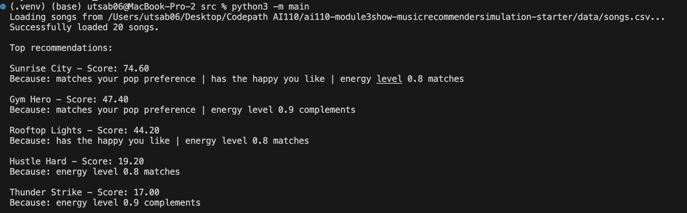
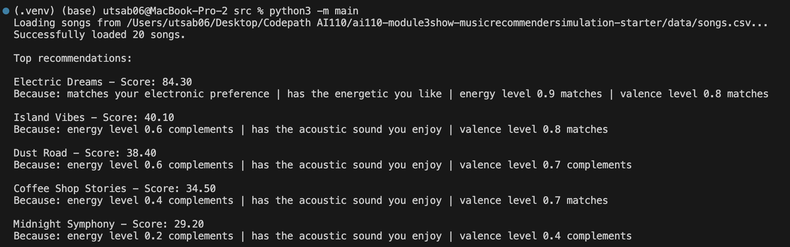
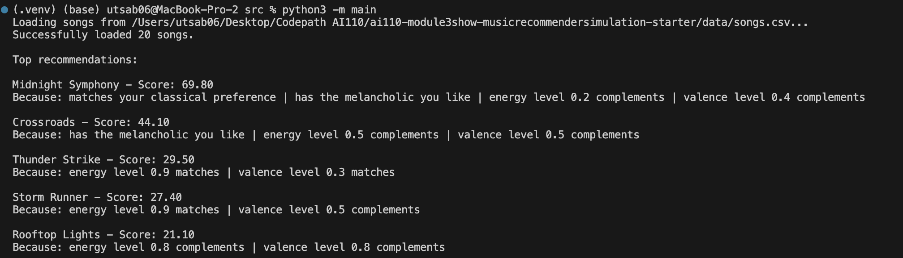
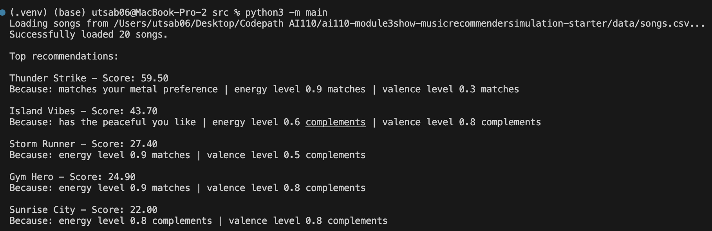
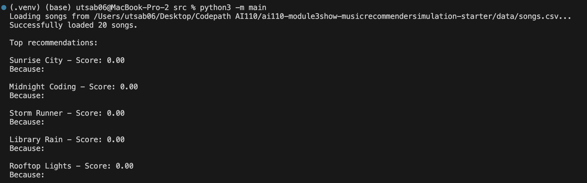
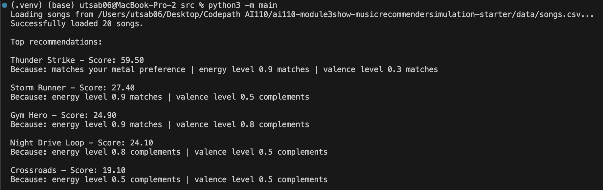

# 🎵 Music Recommender Simulation

## Project Summary

In this project you will build and explain a small music recommender system.

Your goal is to:

- Represent songs and a user "taste profile" as data
- Design a scoring rule that turns that data into recommendations
- Evaluate what your system gets right and wrong
- Reflect on how this mirrors real world AI recommenders

User Taste Profile #1: "Late Night Study Session"

study_user = UserProfile(
    favorite_genre="lofi",
    favorite_mood="chill",
    target_energy=0.40,
    likes_acoustic=True
)

---

## How The System Works

Recommendation systems are built based on approaches namely content-based filtering and collaborative filtering. Content based filtering solely focuses on the metadata or the attributes of the items to be recommended and the preference of the user. There are no user-item interaction history in this approach. Although, it might not provide us with more accurate recommendations, this approach doesn't require larger dataset and works best when there are no user-item interaction data or to tackle cold-start problem. 

Collaborative filtering on the other hand solely depends on the user's interactions with features/items within the system. Two major approach to collaborative filtering are Item-Item based and User-User based collaborative filtering. Item-item based filtering focuses on items a user have interacted most with such as liked, added to the playlist, saved to the library in the past and compares similar items to the user's liking to be recommeded. While user-user based filtering finds similar users based on their interaction history and recommends items top similar users have liked for our given user.

In our project, we don't have access to user interaction history and have rather smaller dataset to work with. Given the limitations, our project will focus on implementing content-based filtering to recommend songs to a user. User have their preference listed in their profile which highlights the genre, mood, energy and whether the user likes acoustic songs or not. We will add target_valence as an attribute to user profile in addition to other features. Similarly, songs have similar attributes in their song. We will use the user preference and song attributes to recommend songs to our user. Each feature used to find recommendation namely genre, mood, energy, acousticness, and valence will be weighted as 30, 25, 20, 15 & 10 respectively. The final score is the summation of these scores for a user and song scoring algorithm. The final list of songs will be generated in sorted order of highest to lowest score. 80% of the recommendation for the user will come from highest scored songs while 20% of ths songs will be the lowest scored from the output based on user preference to add diversity and exploration factor to the recommendation. 

Potential biases in our approach are following:
1) As genre and mood carry heavy points, song that doesn't match these will be penalized with 55 points even though other features might match with user's preference. 
Example: Rooftop Lights (indie pop, happy, 0.82 energy) will always outscore Storm Runner (rock, intense, 0.91 energy) for a pop-loving user, even if the energy match is closer.
2) Lack in negative preferences in UserProfile.
3) Assigning static weights to features might not produce personalized recommendation. Allowing user to modualte weights will produce better recommendations.
4) A single target_valence can't capture user's context dependency.

Some prompts to answer:

- What features does each `Song` use in your system?

  As user preference provides favorite_genre, favorite_mood, target_energy, and likes_acoustic or not boolean value as attributes, we will use genre, mood, energy and acousticness features of the song to use in our recommender systems. In additon target_valence will be added as a feature in user profile and will be used to score songs.

- What information does your `UserProfile` store?

  UserProfile has user preferences namely favorite_genre, favorite_mood, target_energy, and likes_acoustic. target_valence will be added to the UserProfile during implementation.

- How does your `Recommender` compute a score for each song?

  For each song, the feature of the song and user preference are compared based on if they are matched. Genre, mood, energy, acousticness and valence have weights assigned in non-incremental order from 30, 25, 20, 15 and 10 if each values match the user preference. The final score is summation of all the scores for each feature.

- How do you choose which songs to recommend?

  In order to add diversity to the recommendation, we will approach the recommendation with 80% similarity and 20% discovery. Among top K, 80% will be highest ranked and the 20% will be the songs from 40th percentile to 60th percentile.

Results for test example:

user_prefs = {"favorite_genre": "pop", "favorite_mood": "happy", "target_energy": 0.8}


Results for edge cases:

user_prefs = {"favorite_genre": "electronic", "favorite_mood": "energetic", "target_energy": 0.85, "likes_acoustic": True, "target_valence": 0.80}


user_prefs = {"favorite_genre": "classical", "favorite_mood": "melancholic", "target_energy": 0.95, "target_valence": 0.30}


user_prefs = {"favorite_genre": "metal", "favorite_mood": "peaceful", "target_energy": 0.95, "target_valence": 0.30, "likes_acoustic": False}


user_prefs = {}


Results for feature removal:

user_prefs = {"favorite_genre": "metal", "favorite_mood": "peaceful", "target_energy": 0.95, "target_valence": 0.30, "likes_acoustic": False}


---

## Getting Started

### Setup

1. Create a virtual environment (optional but recommended):

   ```bash
   python -m venv .venv
   source .venv/bin/activate      # Mac or Linux
   .venv\Scripts\activate         # Windows

2. Install dependencies

```bash
pip install -r requirements.txt
```

3. Run the app:

```bash
python -m src.main
```

### Running Tests

Run the starter tests with:

```bash
pytest
```

You can add more tests in `tests/test_recommender.py`.

---

## Experiments You Tried

Use this section to document the experiments you ran. For example:

What happened when you changed the weight on genre from 2.0 to 0.5

- The system became less opinionated about genre matching and songs that don't match user's pavoritegenre are less penalized. User who loves pop can get rock recommendation based on match with mood/energy/valence.

What happened when you added tempo or valence to the score

- More precision in matching was observed with addition of valence. Also, more features mean less explainability.

How did your system behave for different types of users

- Mainstream genre listeners are favored and niche users are penalized.

---

## Limitations and Risks

- The dataset is 35% very high energy songs creating high-energy bias. 
- There are unique genres. Among 20 songs there are 14 unique genres. Users whose genre doesn't match get permanent -55 pts penalty.
- Users outside mainstream genres permanently capped at 45 pts creating genre + mpdd weights dominance.

---

## Reflection

Read and complete `model_card.md`:

[**Model Card**](model_card.md)

Write 1 to 2 paragraphs here about what you learned:

- about how recommenders turn data into predictions
- about where bias or unfairness could show up in systems like this


---

## 7. `model_card_template.md`

Combines reflection and model card framing from the Module 3 guidance. :contentReference[oaicite:2]{index=2}  

```markdown
# 🎧 Model Card - Music Recommender Simulation

## 1. Model Name

Give your recommender a name, for example:

> VibeFinder 1.0

---

## 2. Intended Use

- What is this system trying to do
- Who is it for

Example:

> This model suggests 3 to 5 songs from a small catalog based on a user's preferred genre, mood, and energy level. It is for classroom exploration only, not for real users.

---

## 3. How It Works (Short Explanation)

Describe your scoring logic in plain language.

- What features of each song does it consider
- What information about the user does it use
- How does it turn those into a number

Try to avoid code in this section, treat it like an explanation to a non programmer.

---

## 4. Data

Describe your dataset.

- How many songs are in `data/songs.csv`
- Did you add or remove any songs
- What kinds of genres or moods are represented
- Whose taste does this data mostly reflect

---

## 5. Strengths

Where does your recommender work well

You can think about:
- Situations where the top results "felt right"
- Particular user profiles it served well
- Simplicity or transparency benefits

---

## 6. Limitations and Bias

Where does your recommender struggle

Some prompts:
- Does it ignore some genres or moods
- Does it treat all users as if they have the same taste shape
- Is it biased toward high energy or one genre by default
- How could this be unfair if used in a real product

---

## 7. Evaluation

How did you check your system

Examples:
- You tried multiple user profiles and wrote down whether the results matched your expectations
- You compared your simulation to what a real app like Spotify or YouTube tends to recommend
- You wrote tests for your scoring logic

You do not need a numeric metric, but if you used one, explain what it measures.

---

## 8. Future Work

If you had more time, how would you improve this recommender

Examples:

- Add support for multiple users and "group vibe" recommendations
- Balance diversity of songs instead of always picking the closest match
- Use more features, like tempo ranges or lyric themes

---

## 9. Personal Reflection

A few sentences about what you learned:

- What surprised you about how your system behaved
- How did building this change how you think about real music recommenders
- Where do you think human judgment still matters, even if the model seems "smart"

